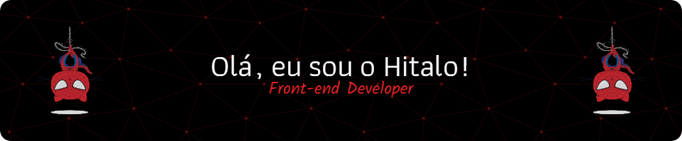

 

<h3>Olá , sou Hitalo Rodrigo Alves!</h3>
 
  
 
- 🚀 Desenvolvedor Javascript em desenvolvimento
- 🌱 Atualmente focado em melhorar minhas habilidades em Javascript, Typescript, ReactJS, NextJS, NodeJS.
- 🔭 Em uma busca constante pela evolução e aprimoramento como dev
- :mortar_board: Sou formado em análise e Desenvolvimento de Sistemas, pelo Instituto Federal de São Paulo - Campus Votuporanga

 

## 🛠 &nbsp; Tecnologias 

&nbsp;
&nbsp;
&nbsp;
&nbsp;
&nbsp;
&nbsp;
&nbsp;
&nbsp;
 
  
 
## ⚙️ &nbsp;GitHub status

 
 

 

## 📫 Fale comigo 👇

